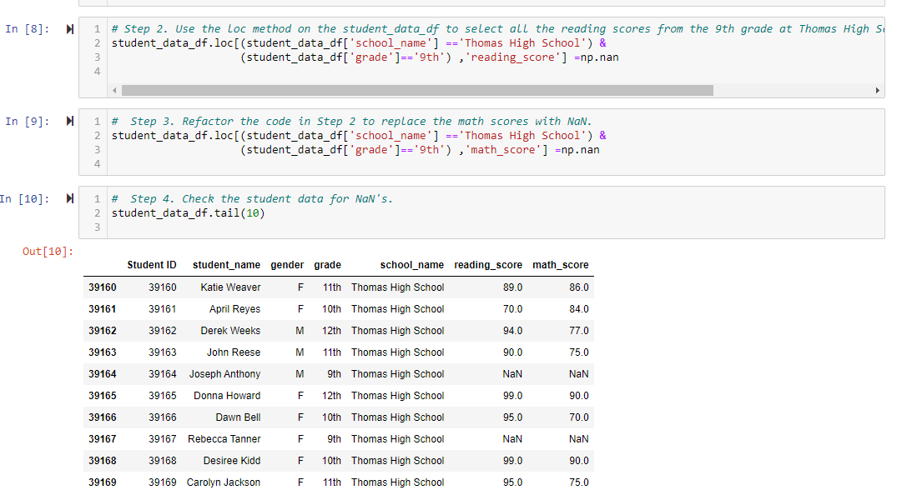
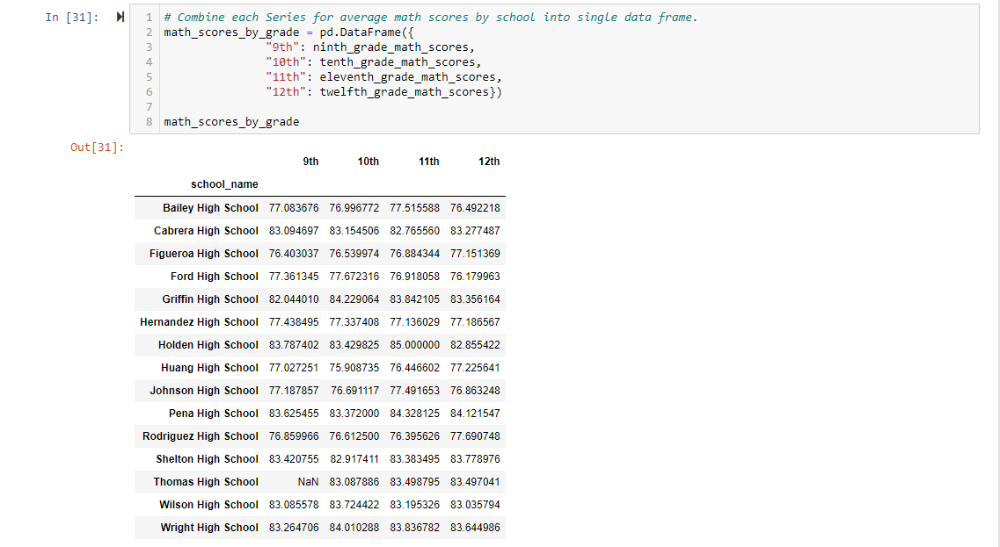
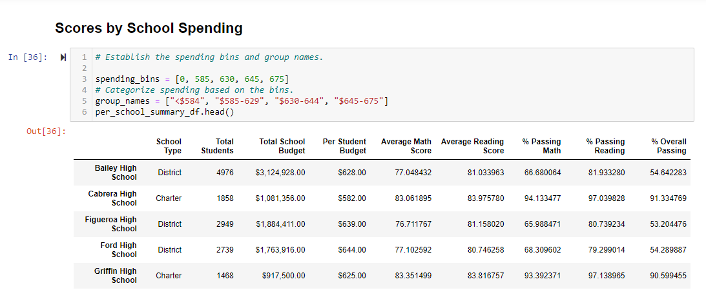

# PyCity School and Disctrict Anaylsis

## Overview

  The purpose of the analysis was to tabulate the students preformane as well as examine the performance of their school and district in regards to how much funding did the school or district receive. Furthermore after this intital process academic dishonesty was found to be a possibility for the students at Thomas high school for the 9th grade and thus those marks had to be stripped from the calculation of the overall analysis.

## Results

Removing a good deal of data points has caused several effects:
- On the school and district summary	On school and district summary: magnitude of effect is yet unknown as the mark for the missing grade 9 class can either sceque the marks left or right or not at all depending on averages

- On relative performance compared to other school: no effect as adding NaN does not get added when judging averages
   - this would also effect the math and reading scores, school size, and school type by grade in the same manner, as making the 9th grade marks null does not directly effect the calculation
  
  

## Conclusion
Due to the changes made, we now only have a partial idea of how the schools in the district are preforming. While making the 9 graders marks for Thomas High NaN did not effect our 
outputs, it does now have to be considered in coming to a conclusion on the state of the district. Due to the changes, the averages for the school district are off. However, what can be said is that in regards of spending, it is clear that Thomas high requires more spending to combat the academic dishonesty present there.

  
